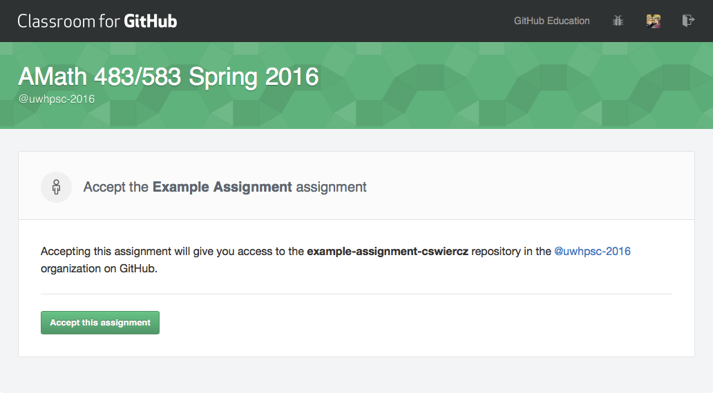
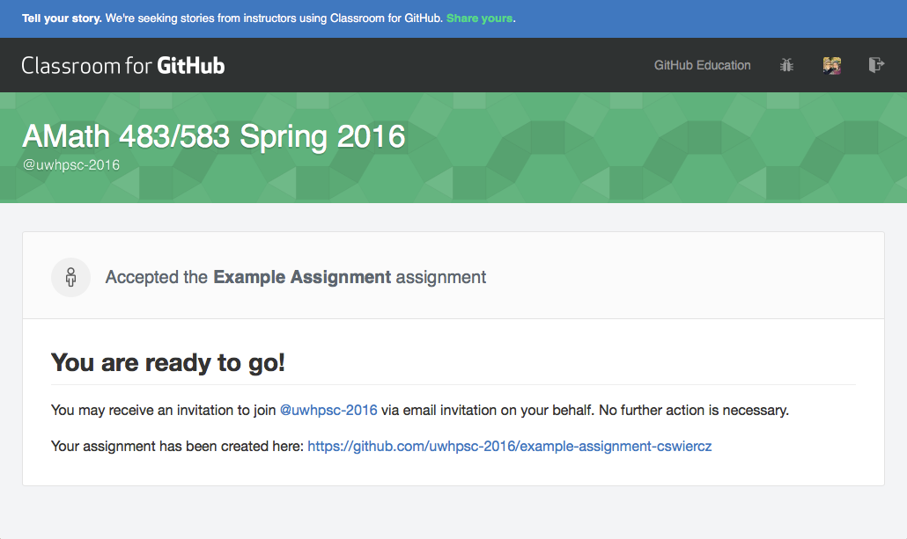
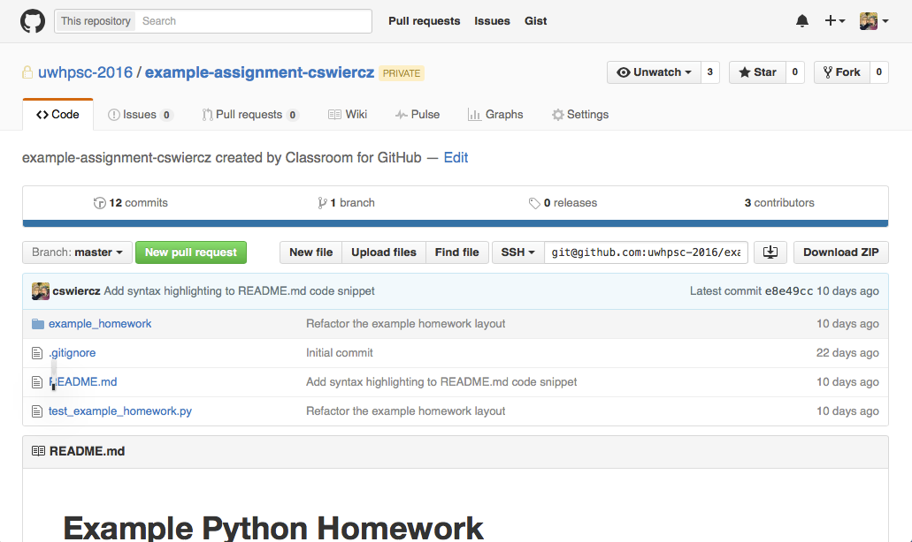

# Homework

Here we describe how to obtain and submit the software portion of the bi-weekly homework.

## Submission Process Overview

Each homework assignment will require that the student provide the implementation to one or more functions in a Python or C library.

1. **Follow the Invitation Link** The instructor will send out a link to the assignment. Click the link. The link will look something like this: https://classroom.github.com/assignment-invitations/fed4a4bece59804c6f448ad6b4278050 
2. **Accept the Assignment** A webpage will open where GitHub will request that you accept the assingment. Click "Accept this assingment" so that your personal (and private) repository can be created. 
3. **Allow GitHub Permission to Access Information** (This may occur.) In order for the assignment to be created Classroom for GitHub needs access to some of the information posted in your GitHub account. This is so that you can receive important emails about the assignment repository.
4. **Confirmation** You should receive confirmation that a copy of the assignment has been created for you as well as a link to the assignment repository. 
5. **Your Repository** Following the link on the confirmation page will take you to your assignment repository. It is essential that you push your changes to this copy and no other copy. For example, you cannot create a separate, public fork of your own. For one, this violates the [academic integrity rules](https://github.com/uwhpsc-2016/syllabus/blob/master/Grading.md). Second, our method for collecting homework will not detect any repositories made outside of the Classroom for GitHub setting. Finally, note that this repo is private to yourself, the instructor, and teaching assistants. 
6. **Work** Complete the assignment. Read this document, our [grading policy](https://github.com/uwhpsc-2016/syllabus/blob/master/Grading.md) as well as the information in the [example homework assignment](https://github.com/uwhpsc-2016/example-python-homework) for information on the homework itself.
7. **Collection** Make sure your work is pushed to your repository by [X] of the day the homework is due. It will be automatically collected at this time. Any late work is not accepted under any circumstances since plenty of time is provided to complete the homework.

## Homework Format

(explain how the homework is formatted)
